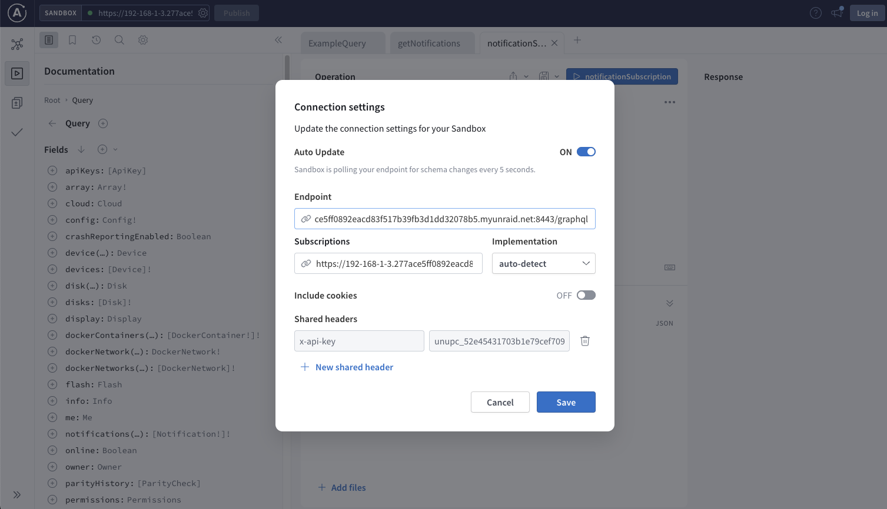

# How to enable introspection and view possible API endpoints for the Unraid API

1. Install the API on your machine
2. Stop the running api with `unraid-api stop`
3. Enable an allowed origin for Apollo Studio:

    - Edit the file at `/boot/config/plugins/dynamix.my.servers/myservers.cfg
    - Add the line `extraOrigins="studio.apollographql.com"` inside of the `[api]` block

        ```ini
            [api]
            ...
            extraOrigins="studio.apollographql.com"
            [local]
            ...rest
        ```

    - Also copy out the `[upc] -> apikey` setting, it should look something like `unupc_52e45431703b1e79cef709bfaf7ddc469bafc12e091b7c9bca0f6e96dc`

4. Enable introspection

    ```sh
    INTROSPECTION=true LOG_LEVEL=trace LOG_TYPE=pretty unraid-api start --debug
    ```

    - If you run this command and it says the Unraid API is already started, run `unraid-api stop` before trying it again.

5. Use introspection to your server with Apollo Sandbox:
    - Navigate your *Chrome* browser to [Apollo Sandbox](https://studio.apollographql.com/sandbox/explorer/)
    - Click the settings icon in the top right corner and set the URL to your servers URL + /graphql. For example a server URL might be: `https://192-168-1-3.277ace5dd0892eacd83f517b39fb3d1dd32078b5.myunraid.net:8443/graphql` or `http://tower.local/graphql`
    - Also set the API key you copied earlier in the header section. Set the key as `x-api-key` and the value to the API key you copied in Step 2.
    

6. Now that your server should be connected, you should see the schema populate. To perform queries, click the plus icon on the field on the left side to add them to a query and then click to run icon on the right.
